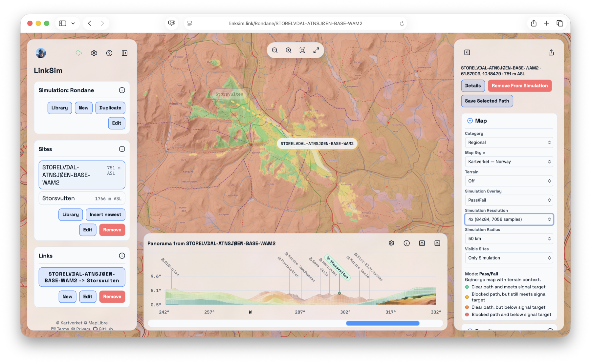
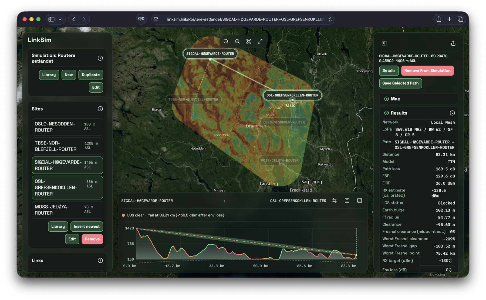

# LinkSim

LinkSim is a web app for terrain-aware radio path planning and simulation.

  
  

## Start Here

| Need | Document |
| --- | --- |
| Use the app | [Getting Started](./docs/onboarding.md) |
| Understand radio models | [RF models and sampling](./docs/rf-models-and-sampling.md) |
| Run or maintain the repo | [Repository guide](./docs/repository-guide.md) |
| Test changes | [Testing plan](./docs/testing-plan.md) |
| Ship a release | [Release flow](./docs/release-flow.md) |
| Reuse UI patterns | UI Gallery (`/ui-gallery`) |
| Review policies | [Security](./SECURITY.md), [Privacy](./docs/legal/PRIVACY.md), [Terms](./docs/legal/TERMS.md) |

## Contribute

Start by opening a [GitHub Issue](https://github.com/wilhel1812/LinkSim/issues) or joining the [Matrix space](https://matrix.to/#/%23linksim:matrix.org).

## License

LinkSim is licensed under [GNU GPL v3.0](./LICENSE).
