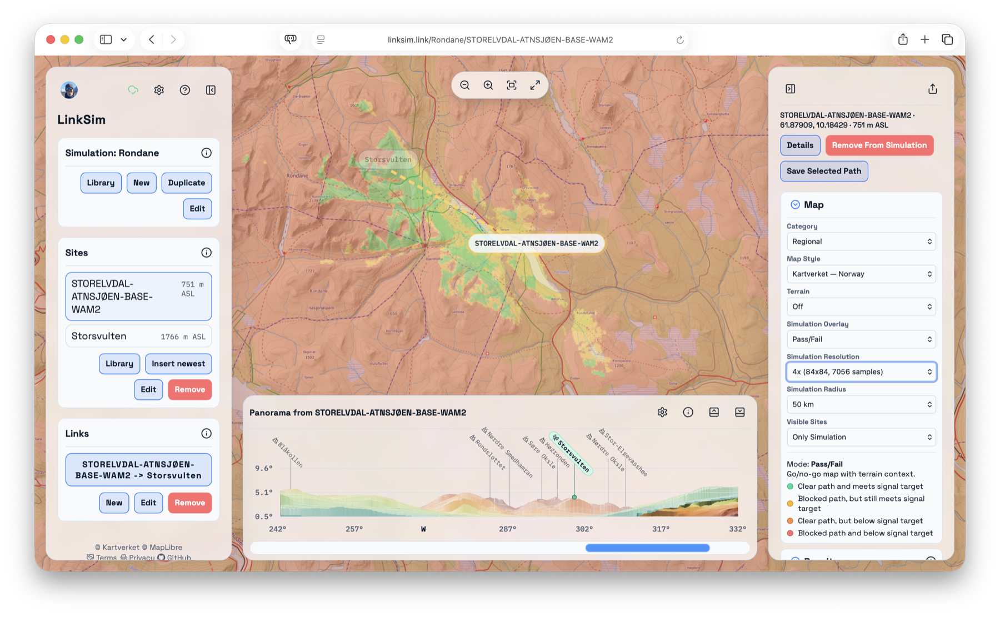
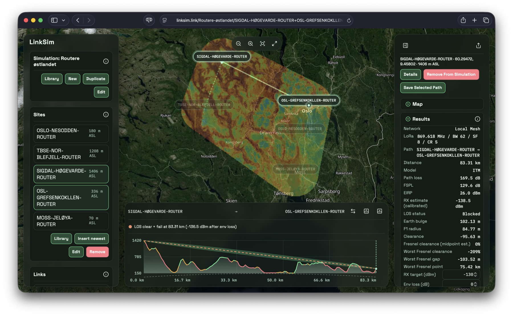

# LinkSim

LinkSim is a web app for terrain-aware radio path planning and simulation.

  
  

## Use LinkSim

| Need | Document |
| --- | --- |
| Learn the workflow | [Getting Started](./docs/onboarding.md) |
| Understand calculations | [RF models and coverage](./docs/rf-models-and-sampling.md) |
| Share a specific view | [Deep links](./docs/deep-links.md) |

## Build and Operate

| Need | Document |
| --- | --- |
| Set up and understand the repository | [Repository guide](./docs/repository-guide.md) |
| Test a change | [Testing plan](./docs/testing-plan.md) |
| Work with shared staging | [Staging environment](./docs/staging-environment.md) |
| Ship a release | [Release flow](./docs/release-flow.md) |
| Configure authentication | [Cloudflare Access and D1](./docs/cloudflare-auth-setup.md) |
| Manage Cloudflare with Terraform | [Terraform guide](./docs/terraform-iac.md) |
| Reuse UI patterns | UI Gallery (`/ui-gallery`) |
| Review policies | [Security](./SECURITY.md), [Privacy](./docs/legal/PRIVACY.md), [Terms](./docs/legal/TERMS.md) |

## Contribute

Start by opening a [GitHub Issue](https://github.com/wilhel1812/LinkSim/issues) or joining the [Matrix space](https://matrix.to/#/%23linksim:matrix.org).

## License

LinkSim is licensed under [GNU GPL v3.0](./LICENSE).
